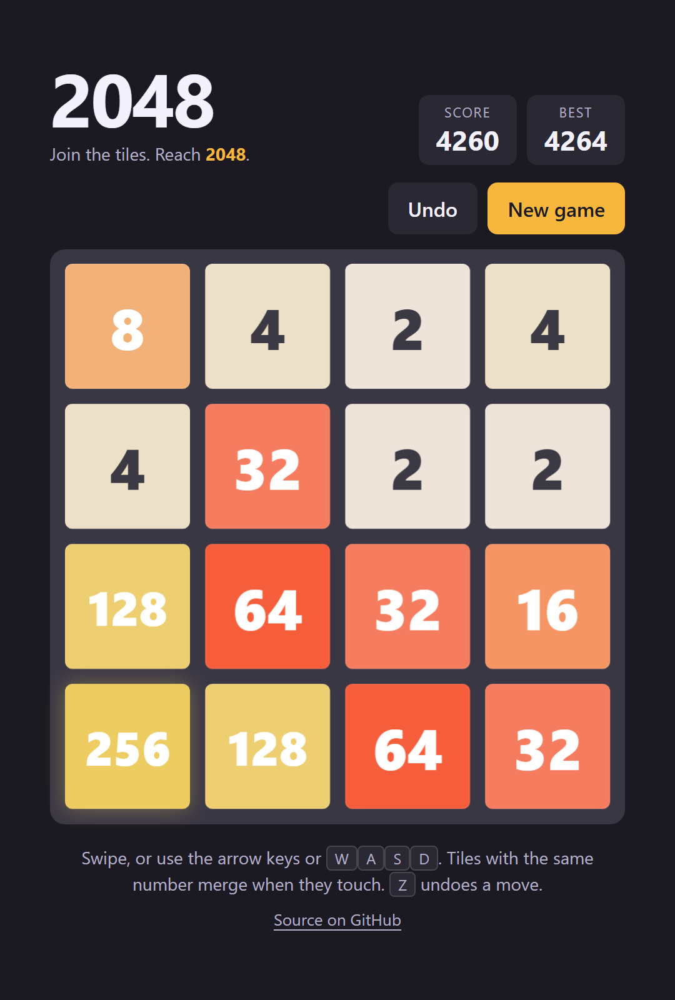

# 2048

A single page 2048 game. One HTML file, no build step, no dependencies.

Play it live at [df0c83kupo7b2.cloudfront.net](https://df0c83kupo7b2.cloudfront.net).

## Play

Open the live site above, or open index.html in a browser.

Arrow keys, WASD or a swipe slide the tiles. Tiles with the same number merge when they touch. Z undoes a move, up to twenty moves back. The board and the best score are kept in the browser's local storage, so a refresh does not lose the game.

## Test

`npm test` runs the sliding, merging, spawning and end of game rules through node's built in test runner. The tests load the script straight out of index.html, so there is nothing to build first.

## Deploy

`npm run deploy` needs AWS CLI v2 signed in to the profile named jt. It creates or updates the CloudFormation stack game-2048 in us-east-1 from infra/template.yaml, uploads index.html to the stack's private S3 bucket, and invalidates the CloudFront cache. The stack is a private bucket, a CloudFront distribution with Origin Access Control, and the bucket policy that lets only that distribution read the files.

The first deploy takes several minutes because CloudFront has to roll the distribution out. Later deploys only push the page and refresh the cache.

## Remove

`npm run destroy` empties the bucket and deletes the stack.
